# Taller de mallas poligonales

## Propósito

Estudiar la relación entre las [aplicaciones de mallas poligonales](https://github.com/VisualComputing/representation), su modo de [representación](https://en.wikipedia.org/wiki/Polygon_mesh) (i.e., estructuras de datos empleadas para representar la malla en RAM) y su modo de [renderizado](https://processing.org/tutorials/pshape/) (i.e., modo de transferencia de la geometría a la GPU).

## Tareas

Hacer un benchmark (midiendo los *fps* promedio) de varias representaciones de mallas poligonales para los _boids_ del ejemplo del [FlockOfBoids](https://github.com/VisualComputing/framesjs/tree/processing/examples/Advanced/FlockOfBoids) (requiere la librería [frames](https://github.com/VisualComputing/framesjs/releases), versión ≥ 0.1.0), tanto en modo inmediato como retenido de rendering.

1. Represente la malla del [boid](https://github.com/VisualComputing/framesjs/blob/processing/examples/Advanced/FlockOfBoids/Boid.pde) al menos de ~tres~ dos formas distintas.
2. Renderice el _flock_ en modo inmediato y retenido, implementando la función ```render()``` del [boid](https://github.com/VisualComputing/framesjs/blob/processing/examples/Advanced/FlockOfBoids/Boid.pde).
3. Haga un benchmark que muestre una comparativa de los resultados obtenidos.

### Opcionales

1. Realice la comparativa para diferentes configuraciones de hardware.
2. Realice la comparativa de *fps* sobre una trayectoria de animación para el ojo empleando un [interpolator](https://github.com/VisualComputing/framesjs/tree/processing/examples/Basics/B8_Interpolation2) (en vez de tomar su promedio).
3. Anime la malla, como se hace en el ejemplo de [InteractiveFish](https://github.com/VisualComputing/framesjs/tree/processing/examples/ik/InteractiveFish).
4. Haga [view-frustum-culling](https://github.com/VisualComputing/framesjs/tree/processing/examples/Demos/ViewFrustumCulling) de los _boids_ cuando el ojo se encuentre en tercera persona.

### Profundizaciones

1. Introducir el rol depredador.
2. Cómo se afecta el comportamiento al tener en cuenta el [campo visual](https://es.wikipedia.org/wiki/Campo_visual) (individual)?
3. Implementar el algoritmo del ```flock()``` en [OpenCL](https://en.wikipedia.org/wiki/OpenCL). Ver [acá](https://www.youtube.com/watch?v=4NU37rPOAsk) un ejemplo de *Processing* en el que se que emplea [JOCL](http://www.jocl.org/).

### References

1. [Reynolds, C. W. Flocks, Herds and Schools: A Distributed Behavioral Model. 87](http://www.cs.toronto.edu/~dt/siggraph97-course/cwr87/).
2. Check also this [nice presentation](https://pdfs.semanticscholar.org/73b1/5c60672971c44ef6304a39af19dc963cd0af.pdf) about the paper:
3. There are many online sources, google for more...

## Integrantes

Máximo 3.

Complete la tabla:

| Integrante | github nick |
|------------|-------------|
| Sebastian David Moreno  | sdmorenob |
| Cristian Camilo Orjuela | CristianOrjuela |

## Entrega

* Modo de entrega: Haga [fork](https://help.github.com/articles/fork-a-repo/) de la plantilla e informe la url del repo en la hoja *urls* de la plantilla compartida (una sola vez por grupo). Plazo: 15/4/18 a las 24h.
* Exposición oral en el taller de la siguiente semana (6 minutos: 4 para presentar y 2 para preguntas). Estructura sugerida:
  1. Representaciones estudiadas.
  2. Demo.
  3. Resultados (benchmark).
  4. Conclusiones.
  
## Funcionalidades adicionales
  
| Nombre                        | Tecla |
|-------------------------------|-------|
| Modo retenido - Modo inmediato|   r   |
| FaceVertex  -  VertexVertex - EdgeVertex  |   f   |
  
  
## Discusión

###  Representaciones estudiadas:

#### Representaciones
 
 Durante la valoración de diferentes alternativas para realizar la representación de las mallas poligonales se consideraron algunos factores importantes tal como la complejidad de las visualizaciones y su implementación en la práctica. Por esta razón, y para observar de mejor manera la aplicación de la malla, se diseñó un prototipo de Boid con una gran cantidad de vértices y caras con el fin de especificar el modelo y visualizar en mayor medida su representación.
 
 Este prototipo fue diseñado en el programa de Blender con el propósito de poder realizar configuraciones particulares y generar una representación más real de lo que es un *Boid*. Inicialmente, se realizó una estructura que tenía como base una estructura a partir de cubos, como se expone en la siguiente imagen:
 
  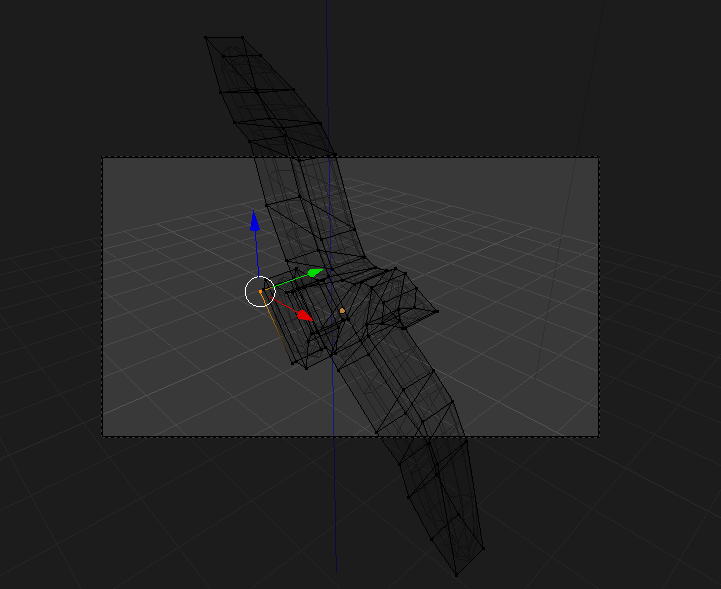
 
 Y que cuando cuenta con textura, se logra visualizar de la siguiente manera.
 
 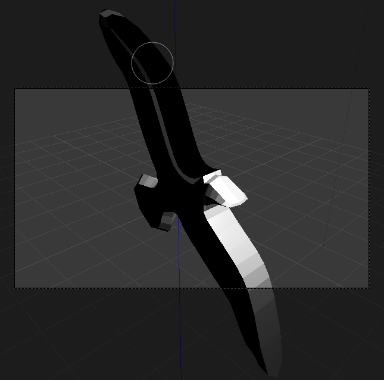
 
 Pero luego, se realizó una modificación en la estructura para realizar la presentación EdgeVertex y VertexVertex, migrando los diseños de cubos a tetraedros. 
 
  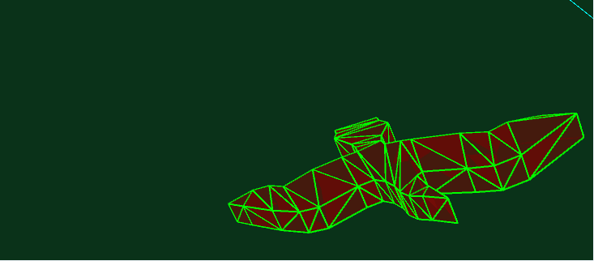
 
 De esta manera, se logró incluir dentro de la representación de mallas poligonales una versión del Boid de mayor complejidad, contando con 120 vértices y 234 caras (faces). Asimismo, a través de cálculos y variaciones se lograron identificar cada uno de los vértices y caras de la malla para realizar las posteriores implementaciones. 

 #### Face-Vertex
 
 La configuración de esta representación se diseñó gracias a la formación de polígonos de acuerdo a un conjunto de vértices base que conforma la figura y que a través de su iteración componen un cara de la malla poligonal. En esta descripción, cada una de las caras tenía asociada un conjunto de vértices *Face( vertex, vertex, vertex)* y su pintura se realizaba a través del _benginShape()_ y el _endShape()_ donde se establecían los vértices que describían cada cara. Tal como lo muestra la siguiente imagen.

  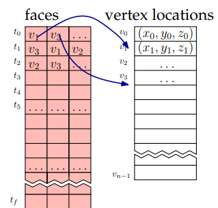
  
 #### Vertex-vertex  
 
 Esta representación se basó en el diseño e implementación de solamente los vértices que componen la malla poligonal. En ese sentido, a través de la función _vertex()_ se configura paso a paso con la estructura dando lugar a una representación de la forma VertexVertex. Un
ejemplo claro es como lo muestra la siguiente figura, donde el vértice *e* hace parte de la representación y tiene asociadas dos conexiones _edges_ que tienen como destino dos ejes finales señalados en naranja en la imagen.

 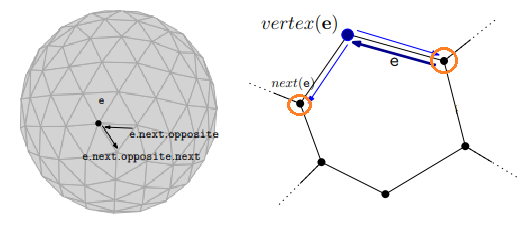
 
 
 #### Edge-vertex
 
 Asimismo, mediante algunos cálculos y desarrollos se estructuró la representación EdgeVertex mediante la cual hay una unión de dos vértices que representan un _edge_ o _eje_ y los posibles vértices que están asociados a esta representación. Además, 
 se tiene en cuenta que una representación a partir de un vértice, configura un sistema EdgeVertex tal como lo muestra la siguiente imagen.
 
 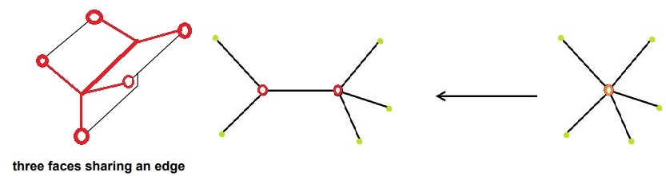
 


 
2. Demo.


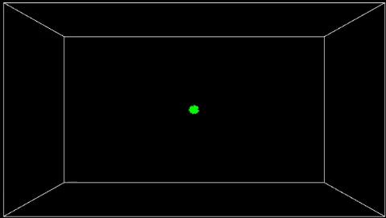


La interacción real con el programa funciona a partir de la modificación de los modos y el tipo de representación que el usuario desea. Por ejemplo, durante la ejecución del modo inmediato, 
se puede visualizar la siguiente representación. Por ejemplo, una muestra del modo inmediato.

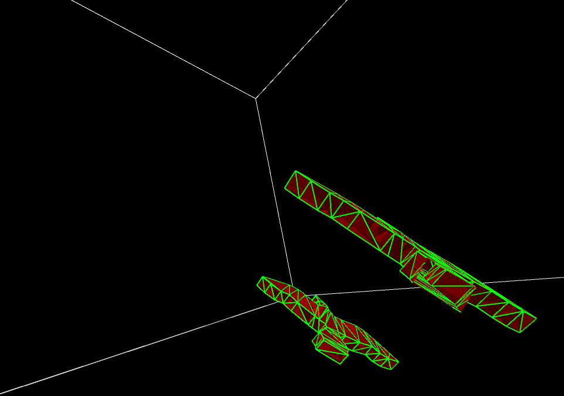

O también, una figura del modo retenido.

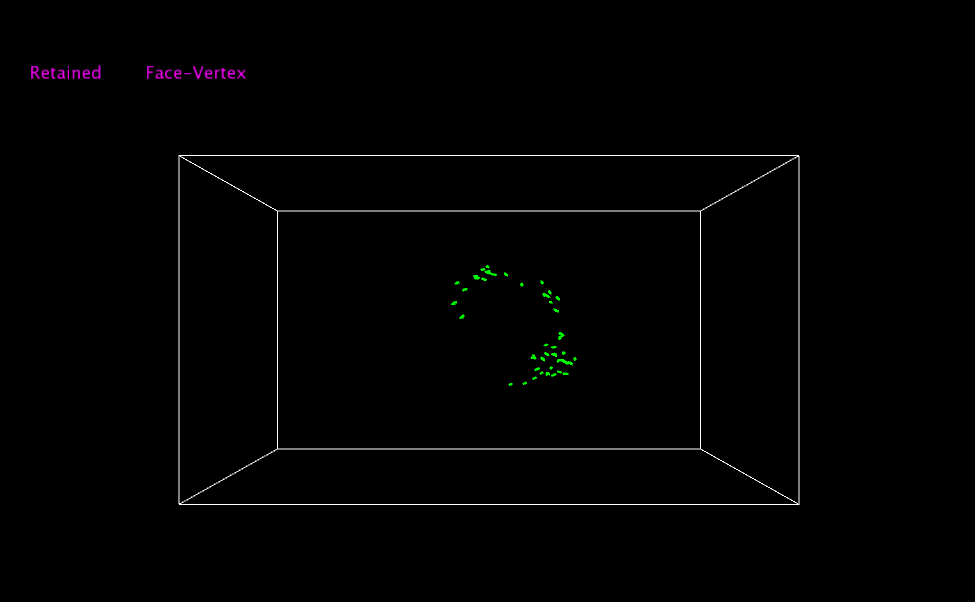

3. Resultados (benchmark).

La construcción de una comparativa entre las diferentes configuraciones de hardware, los modos y las representaciones se identifica a través de la 
representación gráfica de los factores (fps) frames por segundo y la transición en el tiempo. Como primer medida, se realiza la comparativa en una
configuración de hardware con las siguientes características: 

- Configuración No. 1:

	* Procesador: AMD A6-5200 - Radeon(HD) Graphics - 2,00GHz
	* Memoria RAM: 4,00 GB
	
	** Modo inmediato vs No. Boids
	
	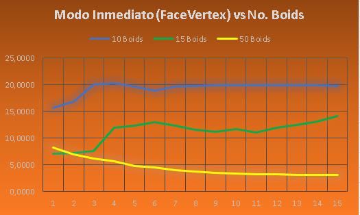
	
	** Modo Inmediato vs Modo Retenido
	
	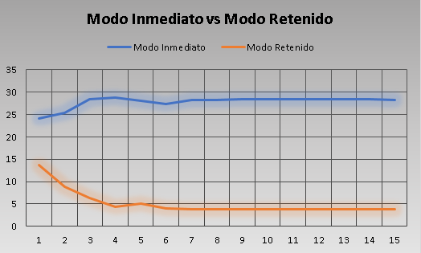
				
		
- Configuración No. 2:

	* Procesador: IntelCore i7-4702MQ - 2,00GHz
	* Memoria RAM: 12,00 GB
	
	
	** Modo inmediato vs No. Boids
	
	
	
	** Modo Inmediato vs Modo Retenido
	
	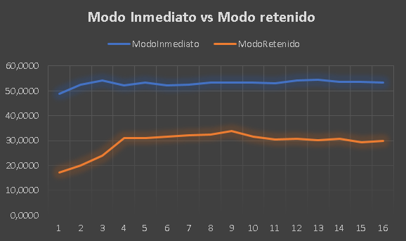
	
	
- Comparativa configuraciones:

	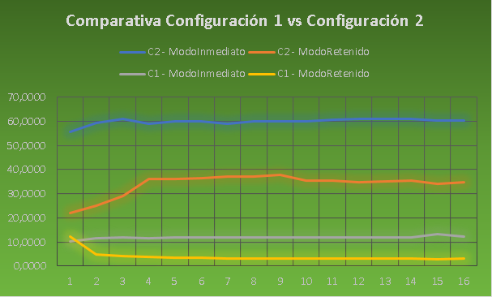
	
4. Conclusiones.

- La representación de la mallas poligonales tienen una gran cantidad de usos y aplicaciones, en este caso concreto, la visualización de un objeto a partir
de su estructuración con simples polígonos (triángulos, cuadrados). 

- Existen grandes variaciones en las representaciones cuando varían noablemente las configuraciones de hardware, es decir, que hay una mayor cantidad de _frames por segundo (fps)_ cuando se cuentan
con mejores recursos.

- Además, es bastante curioso que algunas nociones en la teoría deban representar una parametrización determinada y en la práctica estos conceptos no terminan
de aplicarse de la manera más seria, como se observa en la representación del modo inmediato y el modo retenido.


## Referencias

- [Mallas poligonales - Processing](nozdr.ru/biblio/kolxo3/Cs/CsCg/Botsch%20M.,%20et%20al.%20Polygon%20mesh%20processing%20(AK%20Peters,%202010)(ISBN%201568814267)(C)(O)(243s)_CsCg_.pdf) 

- [Representaciones ... (Edge-Vertex)](https://pdfs.semanticscholar.org/presentation/4702/f55e2d128c65169365e178d01ed3a01ecf61.pdf)

- [Mallas poligonales 2 ](https://en.wikipedia.org/wiki/Polygon_mesh)
 
- [Conceptualización FaceVertex - VertexVertex ](http://www.enseignement.polytechnique.fr/informatique/INF562/Slides/MeshDataStructures.pdf )

- [FaceVertex Meshes](http://www.pathengine.com/Contents/ProgrammersGuide/WorldRepresentation/2DContentProcessing/FaceVertexMeshes/page.php )

- [ Conceptos y representaciones ](http://lgg.epfl.ch/publications/2008/botsch_2008_GMPeg.pdf )

- [ Especificaciones de las representaciones ](https://www.scratchapixel.com/lessons/3d-basic-rendering/introduction-polygon-mesh) 


